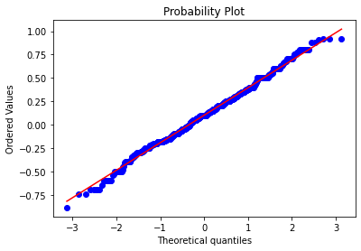

# Sentiment analyses

In this second part of the analysis, the aim is to analyze the gender and sentiment related information that can be extracted from corpora, and to compute some statistics.

Every analysis presented in this section has been performed on subsets of corpora, in particular for texts written before and after 1880.

Inside this section, you will find a sentiment, statistical, and emotion related analysis for what concerns the information that can be retrieved inside each corpus.&#x20;

## Workflow of the section

The sentiment analysis has been performed by reusing, enhancing and modifying (also by adding a more strict analysis of sentences and by developing a better function for character's extraction) the code used by **Neal Caren** in his project ["Using Python to see how the Times writes about men and women"](http://nealcaren.github.io/text-as-data/html/times\_gender.html).

### Functions and methodology

The first thing to do is analyze the corpora thanks to the functions contained in the document for the [gender classification of sentences](https://github.com/gobbykid/corpora\_analytics/blob/main/sentiment\_functions.py).

#### Gendered sentences and raw scores

In particular, the analysis lays on the main function of this file, that is <mark style="color:green;">`gender_analysis`</mark>. This function has been called on each text of the corpus under analysis.


```python
for url in tqdm(f_authors_texts):
    text = text_reader(url)
    gender_analysis(text, f_sent_dict, f_sentence_counter, f_word_counter, 
                female_authors_raw_count, f_word_freq, male_words, female_words)
```


Thanks to this script, we have analyzed, gendered and given a polarity score as well as a qualitative sentiment label to the sentences of each one of the texts contained inside the reference corpus. Finally, we have filled the dictionaries related to such corpus.

In the above snippet, the function <mark style="color:green;">`gender_analysis`</mark> takes many parameters, to clarify, these represent:

* <mark style="color:orange;">text</mark>: represents the readed text;
* <mark style="color:orange;">sent\_dict</mark>: is a dictionary to store the number of tokens, the gender, the polarity and the sentiment score of each sentence;
* <mark style="color:orange;">sentence\_counter</mark>: is a dictionary containing the raw count of gendered sentences, divided for genders;
* <mark style="color:orange;">word\_counter</mark>: contains the overal raw count of tokens for each gender;
* <mark style="color:orange;">raw\_count</mark>: contains the overall number of occurrencies of each token contained in the corpus;
* <mark style="color:orange;">word\_freq</mark>: stores the count of how many times a particular token is used foe each gender;
* <mark style="color:orange;">male\_words</mark>, <mark style="color:orange;">female</mark>_<mark style="color:orange;">\_</mark>_<mark style="color:orange;">words</mark>: represent the lists of gendered tokens used to disambiguate between genders;

As a last step of this first part of the process, we printed out the differences between gendered and not-gendered sentences in terms of raw percentages.\
Then, by following a statistical analysis of the sentences in each corpus, we tried to determine if the differences between the way in which female/male authors deal with male and female gendered sentences are significant. In particular, what we wanted to do was to determine whether the mean of the sentences related sentiment scores were significantly different.

### Statistical analysis

In order to do that we will first display the dimensions of the extracted populations of positive, negative and neutral sentences. These numbers are useful for us in order to build a meaningful sample.

#### Sample building

Seen that the aim of the analysis is to see whether a significant difference between the means of the two different sets of score (for male and female related sentences) exists, we will try to perform a _<mark style="color:purple;">t-test for independent samples</mark>_.\
In order to be able to perform such statistical test, we first need to create two equally large samples. The dimension of the sample has been chosen by computing the 10% of the entire population to sample. In order to avoid samples too large, we opted for a maximum size of 800 scores each (number decided by looking at the overall counts of sentences), which provides a total sample size of 1600 elements.

The sampling operation is computed for both female and male related sentences that has a positive or negative score. Neutral sentences will not be considered in this analysis because of the fact that we do not think that their values should be taken into account. Behind this choice there is  the fact that, by analyzing some of the sentences extracted, we noticed that neutral sentences are not so essential because many times are referred to landscapes descriptions made by female or male characters and risk to mislead the analysis.

<figure><figcaption><p><em>SRS</em> explanatory schema</p></figcaption></figure>

To build such sample, we decided to adopt the SRS (Stratified Random Sampling) in order to have equally distributed samples, proportionally extracted from the populations. For an overview on such operation you can look here: [SRS](https://en.wikipedia.org/wiki/Stratified\_sampling).

#### t-test and its assumptions

Once we have our samples, we need to check for the assumptions of the _<mark style="color:purple;">t-test</mark>_:

* Continuous or ordinal scale of measurement: this one is easily confirmed by simply looking at the scores;
* Data must be collected from a representative, randomly selected and reasonably large sample size of the total population: again, this has yet been accomlished by the random sampling operation performed in the previous step;
* Data must follow the rules of a normal distribution (we will consider the standard threshold of 5%): in order to check for this assumption we wrote the <mark style="color:green;">`check_distribution`</mark> function that you can find in the analytics functions file, and we will use it to analyze the distribution of data;
* Homogeneity of variance: in order to check this last assumption, we will use a function contained in the analytics functions file that allow us to perform an _<mark style="color:purple;">f-test</mark>_.

Starting from the sentences about female, we checked for the kind of distribution that our data follow.\
In particular, we look for a <mark style="color:purple;">normal distribution</mark> of both the samples in order to meaningfully compare the extracted means of the data related to positive and negative sentences inside and outside this corpora.

<figure><figcaption><p>Distribution of general sample</p></figcaption></figure>

After that, we will compute the mean and the std of the sentences we are dealing with (only if the distribution is normal).

In order to highligth some hidden details of our data, we decided to transform them thanks to a _<mark style="color:purple;">BoxCox transformation</mark>_ (for a reference, click [here](https://www.statisticshowto.com/probability-and-statistics/normal-distributions/box-cox-transformation/)).\
Finally, we will display a graph that shows the distribution of the scores.


BoxCox brief explanation


Subsequently, we performed an _<mark style="color:purple;">f-test</mark>_ on variances to check for their homogeneity.

As last step, we obviously performed the _<mark style="color:purple;">t-test</mark>_ for independent samples_._

### Emotion extraction

This section is concluded with the extraction of the emotion raised by the authors, in this way we will be able to see in the comparative analysis of corpora the kind of emotions of which authors with different gender invest their works.


